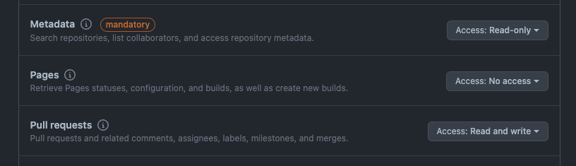

<div align="center">

[](https://github.com/yanovation/delete-old-actions/blob/main/LICENSE.md)
[](https://github.com/yanovation/delete-old-actions/commits/main)
[](https://github.com/yanovation/delete-old-actions/graphs/contributors)
</div>

# About

Removes old GitHub Actions runs to keep your repository clean.
You are advised to run this action with the dry-run option first to see what will be deleted.  
When you are ready to use this, you can schedule it to check periodically.

**WARNING: Deletion cannot be undone. Use at your own risk.**

# Usage

```yaml
on:
  schedule:
    - cron: '0 0 * * *' # Run every day at midnight

jobs:
  delete-old-actions:
    runs-on: ubuntu-latest
    steps:
      - uses: actions/checkout@v2
      - uses: yanovation/delete-old-actions@v1
        with:
          token: ${{ secrets.GITHUB_TOKEN }}
          dry-run: true
          days: 30
```

In order to avoid facing GitHub API rate limits, we use Github Action's default token which is set as
`${{ github.token }}`. You can also manually set this default value to either `${{ secrets.GITHUB_TOKEN }}` or
`${{ github.token }}`.
This token is automatically generated by GitHub and is scoped to the repository that is currently running the action,
and does not have enough permission to comment on the Pull Request. You can override this token with a personal
access token (PAT) with a limited scope.
To create a PAT on Github:

- Go to your [Github settings](https://github.com/settings/profile)
- Open Developer settings
- Open Personal access tokens
- Open Fine-grained access
- Click on Generate new token
- Select the necessary permissions
- Click on Generate token

I recommend to use fine-grained access rights limited to one repository and only for commenting on Pull Requests:



After having created the token, you can add it as a secret to your repository:

- Go to your repository
- Open Settings
- Open Secrets
- Click on New repository secret
- Add the token as a secret
- Use the secret name in your workflow file (i.e. `GH_PAT`)

Example with Personal Access Token (PAT):

```yaml
on:
  schedule:
    - cron: '0 0 * * *' # Run every day at midnight

jobs:
  delete-old-actions:
    runs-on: ubuntu-latest
    steps:
      - uses: actions/checkout@v2
      - uses: yanovation/delete-old-actions@v1
    with:
      token: ${{ secrets.GH_PAT }}
      dry-run: true
      days: 30
``` 

# Release a new version

Code owners can create a release by tagging the version as follows:
First create a major release branch from the master branch and push it:

```bash
git checkout -b release/v1
git push origin release/v1
```

Or checkout to it if it already exists and pull the latest changes:

```bash
git checkout release/v1
git pull origin release/v1
```

If needed, you can fetch changes from master back to the release branch:

```bash
git checkout release/v1
git merge master
git push origin release/v1
```

Then create a tag and push it to the release branch:

```bash
# Update the version before running the command
RELEASE_VERSION="v1.0.0"
git tag "${RELEASE_VERSION}" -m "Minor release: ${RELEASE_VERSION}"
git push origin "${RELEASE_VERSION}"
```

Then move the major version tag (for example v1) to point to the Git ref of the current release:

```bash
git tag -fa v1 -m "Major release: v1"
git push origin v1 --force
```

Then remember to push to Github Marketplace by releasing manually from the GUI.